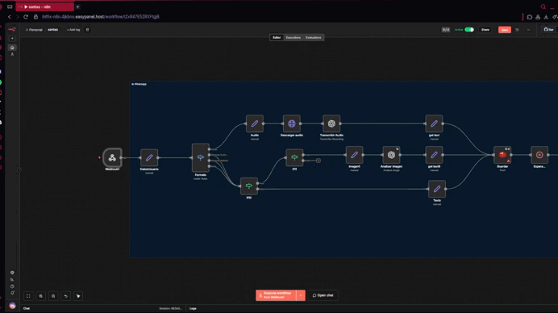
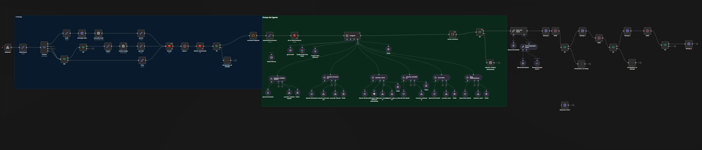

# Conversational-AI-Orchestrator-N8N

**Backend conversacional basado en estados construido con n8n, PostgreSQL e inteligencia artificial.**

El sistema expone un webhook que recibe mensajes de usuarios, normaliza múltiples formatos de entrada, detecta intención, mantiene contexto de sesión y ejecuta acciones utilizando herramientas internas que consultan fuentes de datos reales.

---

## Descripción General

Este proyecto implementa un orquestador conversacional que conecta agentes de IA con herramientas especializadas para resolver consultas de distintos dominios de información.

El enfoque principal es garantizar respuestas determinísticas, sin invención de datos, con validación previa y control de estado.

---



---

## ¿Qué hace este workflow?

- Recibe mensajes vía Webhook  
- Soporta texto  
- Detecta intención del usuario mediante agente LLM  
- Mantiene memoria persistente en PostgreSQL  
- Valida entidades antes de consultar datos  
- Ejecuta sub-agentes especializados por dominio  
- Usa herramientas internas para obtener información real  
- Evita invención de datos  
- Devuelve respuestas listas para integrarse con chatbots, WhatsApp o frontends  

---

## Dominios Soportados

- Entidades geográficas  
- Establecimientos  
- Proveedores  
- Actividades / categorías  
- Rutas o itinerarios  
- Búsquedas por nombre  

---

## Arquitectura de Agentes

El agente principal delega en sub-agentes especializados:

- Zone Validator  
- Establishment Finder  
- Provider Finder  
- Activity Finder  
- Route Builder  

Cada sub-agente solo puede utilizar su herramienta correspondiente.

---

## Modelo Conversacional

NEW → VALIDATING_INPUT → CALLING_TOOL → FORMATTING_RESPONSE → DONE


El contexto se persiste como JSON en PostgreSQL y se reutiliza entre mensajes.

---

## Reglas de Diseño

- No inventar información  
- No asumir datos faltantes  
- Validar entidades antes de usar filtros  
- Una herramienta por dominio  
- Las respuestas solo pueden contener datos devueltos por herramientas  

---

## Tecnologías

- n8n (self-hosted)  
- PostgreSQL  
- OpenAI  
- JavaScript (Code Nodes)  
- Webhooks REST  
- JSON / JSONB  

---

## Estructura del Repositorio

docs/
workflow/
database/
README.md



---

## Objetivo del Proyecto
   Proveer una base sólida para construir asistentes conversacionales confiables, con:

   Control de estado

   Uso estructurado de IA

   Separación entre razonamiento y ejecución

   Arquitectura escalable

   Estado del Proyecto:
   Activo y en evolución.

---

## Cómo Usar

1. Importar el workflow JSON en n8n  
2. Configurar credenciales de PostgreSQL y OpenAI  
3. Crear las tablas con los scripts de database  
4. Exponer el webhook  

Ejemplo de request:

```json
{
  "message": "buscar alojamientos en una localidad",
  "user_id": "user_demo",
  "source": "web"
}
